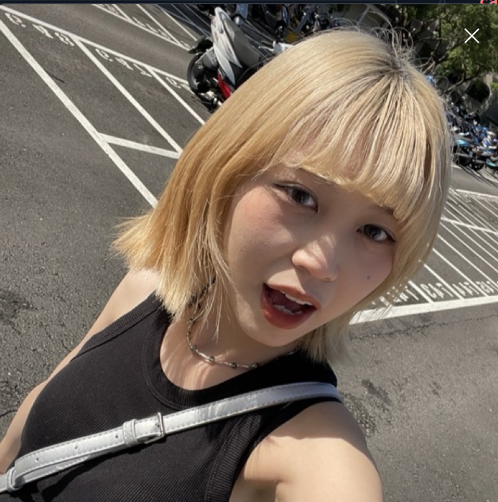

## 每一天都想對你說的話

親愛的軒瑀，你知道嗎？每當我看到你的笑容，整個世界都變得明亮起來。你的存在就像是我生命中最美好的奇蹟，讓平凡的日子都充滿了意義。

## 你就是我的小太陽 ☀️

- 你的笑聲比任何音樂都動聽
- 你的眼神比星空還要璀璨
- 你的溫柔比春風還要暖心
- 你的存在比任何寶藏都珍貴

## 想和你一起做的一萬件小事

### 🌸 春天

- 一起去看櫻花飛舞，手牽手走過花瓣雨
- 在公園裡野餐，你躺在我腿上看雲朵變化
- 種一盆小植物，看它慢慢長大就像我們的愛情

### 🌞 夏天

- 一起吃冰淇淋，你總是會分給我一口最好吃的
- 在海邊看夕陽，聽海浪聲和你的心跳
- 半夜一起看星星，許下只有我們知道的願望

### 🍂 秋天

- 踩著滿地的落葉，聽腳步聲交織的旋律
- 一起喝熱可可，你的手永遠比我的還要溫暖
- 窩在沙發上看電影，你靠在我肩膀上的重量剛剛好

### ❄️ 冬天

- 一起堆雪人，雖然你總是把雪球丟到我臉上
- 圍著圍巾在雪地裡漫步，呼出的白氣交融在一起
- 在溫暖的房間裡擁抱，外面再冷也不怕

## 你知道嗎？

每當我想到你，嘴角就會不自覺地上揚。你就像是我心中的小秘密，甜蜜得讓我想要藏起來，卻又忍不住想要告訴全世界。

你的每一個小習慣我都覺得可愛：

- 睡覺時會抱著枕頭的樣子
- 專心工作時皺眉的表情
- 吃到好吃的東西時眼睛發亮的模樣
- 撒嬌時軟軟的聲音

## 未來的每一天

我想和你一起慢慢變老，看遍世界的美景，嚐盡人間的美食。不管未來會遇到什麼，只要有你在身邊，我就有勇氣面對一切。

你是我的今天，我的明天，我的永遠。💕

## 最後想說

軒瑀，謝謝你走進我的生命，讓我知道什麼是真正的幸福。我會用盡我的一生來愛你、寵你、保護你。

你永遠是我心中最美的女孩 🌹

_愛你的人 ❤️_
